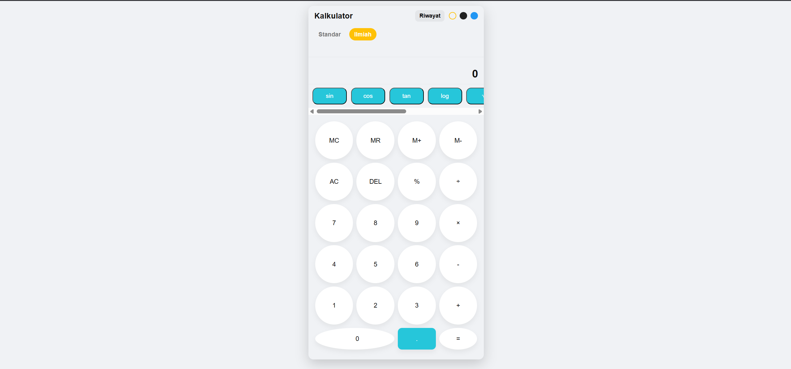

# README Proyek Kalkulator Sederhana & Ilmiah

Tugas Akhir Praktikum Pemrograman Web - Judul 5: Membuat Kalkulator

***

## 1. Identitas Mahasiswa

| Keterangan | Detail |
| :--- | :--- |
| **Nama** | Dimas Faqih Nur Aulia Rohman |
| **NPM** | 2315061059 |
| **Mata Kuliah** | Praktikum Pemrograman Web |
| **Judul Proyek** | Kalkulator Sederhana & Ilmiah (Calculator) |

***

## 2. Deskripsi Proyek

Proyek ini adalah implementasi **kalkulator berbasis web** menggunakan HTML, CSS, dan JavaScript murni. Kalkulator ini dirancang dengan antarmuka yang responsif dan menyediakan dua mode utama: **Standar** dan **Ilmiah**. Proyek ini juga mencakup fitur manajemen memori, riwayat perhitungan, dan tiga pilihan tema visual.

### Fitur Utama:

* **Dua Mode Operasi**:
    * **Mode Standar (Basic)**: Menyediakan operasi aritmatika dasar (`+`, `-`, `×`, `÷`, `%`).
    * **Mode Ilmiah (Scientific)**: Menambahkan fungsi-fungsi matematika tingkat lanjut seperti `sin`, `cos`, `tan`, `log`, `√` (akar kuadrat), `x²` (pangkat dua), `exp` (eksponensial), dan konstanta `π`.
* **Manajemen Memori**: Tombol `MC` (Memory Clear), `MR` (Memory Recall), `M+` (Memory Add), dan `M-` (Memory Subtract).
* **Riwayat Perhitungan (History)**:
    * Menampilkan riwayat perhitungan singkat di bawah layar utama.
    * Tombol "Riwayat" (`history-toggle`) menampilkan **Riwayat Lengkap** dalam modal, yang memungkinkan pengguna untuk memuat kembali hasil perhitungan, menghapus seluruh riwayat, atau mengekspornya dalam format JSON.
* **Pilihan Tema**: Tersedia tiga tema visual yang dapat dipilih oleh pengguna: **Light** (terang), **Dark** (gelap), dan **Blue** (biru).
* **Input Keyboard**: Mendukung input angka, operator, dan perintah dasar (`Enter`/`=` untuk hitung, `Backspace` untuk hapus satu karakter, `Delete` untuk *all clear*) melalui keyboard.
* **Format Angka**: Menggunakan format desimal dengan koma (`,`) sesuai standar bahasa Indonesia (`id`).

***

## 3. Teknologi yang Digunakan

| Teknologi | Keterangan |
| :--- | :--- |
| **HTML5** | Struktur dasar dan *markup* antarmuka kalkulator. |
| **CSS3** | Penataan gaya, responsivitas, dan implementasi tema visual (menggunakan **CSS Variables** untuk tema Light, Dark, dan Blue). |
| **JavaScript (ES6+)** | Logika inti kalkulator, termasuk kelas `Calculator`, penanganan operasi, fungsi ilmiah, manajemen memori, dan interaksi UI (tema, mode, riwayat). |

***

## 4. Tampilan Aplikasi (Screenshots)

Berikut adalah beberapa tangkapan layar (screenshot) dari aplikasi kalkulator:

### Mode Standar (Basic)

Tampilan kalkulator dalam mode Standar.

### Mode Ilmiah (Scientific)

Tampilan kalkulator setelah beralih ke mode Ilmiah, menampilkan tombol fungsi lanjutan.

### Modal Riwayat Lengkap

Tampilan modal Riwayat Lengkap yang berfungsi untuk melihat, menghapus, atau mengekspor semua catatan perhitungan.

